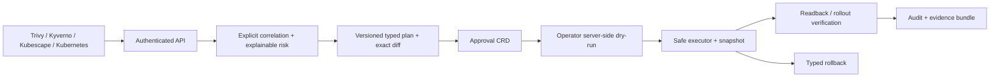

# KubeAthrix

KubeAthrix is an open-source Kubernetes guardrail and remediation control plane
that turns noisy security and reliability findings into reviewable, typed,
approval-aware changes with verification and audit evidence.

The repository is release-candidate quality, but remains **pre-release** until
the release workflow publishes digest-pinned, scanned, signed images and an OCI
chart. Planning is deterministic by default. Version 0.2.0 does not call an AI
model and never executes arbitrary shell or `kubectl` input.

## Why

Security scanners, policy engines, and native Kubernetes signals produce many
isolated alerts. Operators still have to establish shared context, assess blast
radius, design a safe change, collect approval, prove rollout health, preserve
rollback state, and assemble evidence. KubeAthrix provides that control loop
without turning a model or scanner recommendation into an unconstrained write.



## Maturity

| Capability | 0.2.0 status |
| --- | --- |
| OIDC/JWT, PKCE console login, roles and scopes | Implemented; fail-closed by default |
| Native, Trivy, Kyverno, Kubescape findings | Implemented against discovered report APIs |
| Correlation, risk explanation, filters, grouping, pagination | Implemented with explicit keys/time windows |
| Finding lifecycle and expiring exceptions | Implemented in memory/Postgres with audited actor identity; evidence expiry defaults to 24h |
| CRD workflow, approvals, live status mirroring | Implemented |
| Quota/LimitRange, Pod Security labels, workload resources, PDB, explicit probes | Direct executors implemented; mutation disabled by default |
| Network, RBAC, image, node, secret, destructive actions | Proposal-only |
| Verification and rollback | Implemented for direct typed executors with readback/rollout checks and snapshots |
| Falco and Tetragon | Adapter interfaces only; not reported healthy |
| Chaos | Bounded preflight by default; opt-in persistent approval, execution, abort, cleanup, and recovery lifecycle implemented for Chaos Mesh |
| AI/model gateway | Not implemented; reference inventory only |
| GitOps pull-request export | Not implemented; proposals are visible as exact manifests/diffs only |
| Distributed tracing | Optional OTLP/HTTP tracing implemented; disabled by default |

## Secure installation

Prerequisites: Kubernetes 1.28+, Helm 3.14+, an OIDC public client configured
for Authorization Code + PKCE, and production external Postgres. The OIDC token
must contain documented KubeAthrix roles and cluster/namespace scopes.

```powershell
helm dependency build charts/kubeathrix
helm upgrade --install kubeathrix ./charts/kubeathrix `
  --namespace kubeathrix --create-namespace `
  --set auth.oidc.issuerURL=https://identity.example.com/realms/platform `
  --set auth.oidc.clientID=kubeathrix `
  --set postgres.external=true `
  --set postgres.host=postgres.example.internal `
  --set postgres.existingSecret=kubeathrix-postgres
```

Authentication, direct mutation, external engines, and chaos behavior use
secure defaults: authentication is required; mutation and chaos execution are
off; scanner flags do not manufacture healthy integration status. Register the
console URL as the OIDC redirect URI. See
[authentication](docs/authentication.md) and [installation](docs/installation.md).

### Isolated demo

The following grants every request administrator access. Use it only on an
isolated local cluster with no sensitive data or network exposure.

```powershell
helm upgrade --install kubeathrix ./charts/kubeathrix `
  --namespace kubeathrix --create-namespace `
  --set auth.insecureDevelopmentMode=true
kubectl -n kubeathrix port-forward svc/kubeathrix-console 8080:80
```

### Production checklist

- Install the signed OCI chart and set all three component image digests from
  the release manifest; verify Cosign signatures and provenance.
- Use HA external Postgres with TLS, backups, monitoring, and tested restore.
- Review ClusterRoles, OIDC claim mapping, namespace scopes, egress, and report
  CRD permissions. Leave `remediation.mutationEnabled=false` until validated.
- Enable only required scanner dependencies and observe their actual health.

## Permissions and safety

The API reads Kubernetes inventory, KubeAthrix workflow CRDs, and supported
report CRDs. It writes only KubeAthrix workflow objects and approval state. The
operator has the narrow verbs needed by implemented typed actions and a
namespace Role for rollback snapshots. Chaos execution is disabled by default.
When explicitly enabled with a non-system namespace allowlist, a compatible
Chaos Mesh installation, and durable Postgres, the API receives narrowly
scoped get/list/watch/create/delete permissions for three allowlisted kinds.
Every created object carries its persistent run ownership label and is deleted
on duration expiry or abort before recovery can be reported as successful.

Every direct action is catalog-validated, server-side dry-run, snapshotted,
applied, read back, and verified. Workload actions wait for controller rollout
health. Unsupported actions are rejected or proposal-only. API states such as
`succeeded`, `verified`, and `resolved` come from controller-observed cluster
state, not the request that asked for execution.

## Data and privacy

Finding evidence, workflow history, exceptions, provider-reference inventory,
and audit events are stored in Postgres when configured. Workflow CRDs and
rollback snapshot ConfigMaps are stored in Kubernetes. The native inspector
does not request Secret objects; Trivy secret matches are normalized without
copying the matched value. No model egress is implemented. Telemetry egress exists only
when an operator explicitly enables the optional tracing configuration. OIDC
access tokens are held in browser session storage and are not persisted by the API.

Optional OpenTelemetry traces use W3C propagation and OTLP/HTTP batch export.
Tracing is off by default; endpoint credentials must come from a Kubernetes
Secret through `telemetry.tracing.existingSecret`.

## Operator example

```powershell
$headers = @{ Authorization = "Bearer $env:KUBEATHRIX_TOKEN" }
Invoke-RestMethod http://127.0.0.1:8081/api/findings?severity=high'&'limit=25 -Headers $headers
Invoke-RestMethod http://127.0.0.1:8081/api/action-catalog -Headers $headers
```

The console shows why a finding matters, evidence timestamps and provenance,
affected resources, exact typed diffs, permissions, approval policy, live run
state, verification results, rollback controls, evidence export, and expiring
exceptions. It also renders explicit loading, empty, stale, permission, and
failure messages.

Open and in-review findings whose newest evidence exceeds `api.findingExpiry`
(24 hours by default) transition to `expired` with a system audit event. Fresh
scanner evidence reopens the finding. Set a different positive Go duration in
Helm when source reporting intervals require a longer freshness window.

## Development and verification

```powershell
corepack enable
pnpm install --frozen-lockfile
make verify
```

`make verify` runs Go formatting/vet/tests, console tests/build, OpenAPI parsing,
and Helm lint/template checks. CI additionally runs race, Playwright desktop and
mobile, Postgres restart/migration, manifest security, dependency/SAST/secret/
license checks, image SBOM/scans, and a Kind install.

Repository layout:

- `services/api`: Go API, auth, adapters, Postgres, cluster workflow client.
- `operator`: controller-runtime typed execution, verification, rollback.
- `pkg/actioncatalog`: versioned action safety registry shared by API/operator.
- `apps/console`: React/TypeScript OIDC-enabled operator console.
- `charts/kubeathrix`: chart, CRDs, RBAC, network policy, secure workloads.

## Known limitations and help

Chaos execution, a model gateway, GitOps PR creation, real Falco/Tetragon
adapters, and large-cluster performance claims are not in
0.2.0. See the [roadmap](docs/roadmap.md), [FAQ](docs/faq.md),
[troubleshooting](docs/troubleshooting.md), and
[compatibility matrix](docs/compatibility.md).

Contributions are welcome under [Apache-2.0](LICENSE). Read
[CONTRIBUTING.md](CONTRIBUTING.md), [SECURITY.md](SECURITY.md),
[SUPPORT.md](SUPPORT.md), and [GOVERNANCE.md](GOVERNANCE.md).
